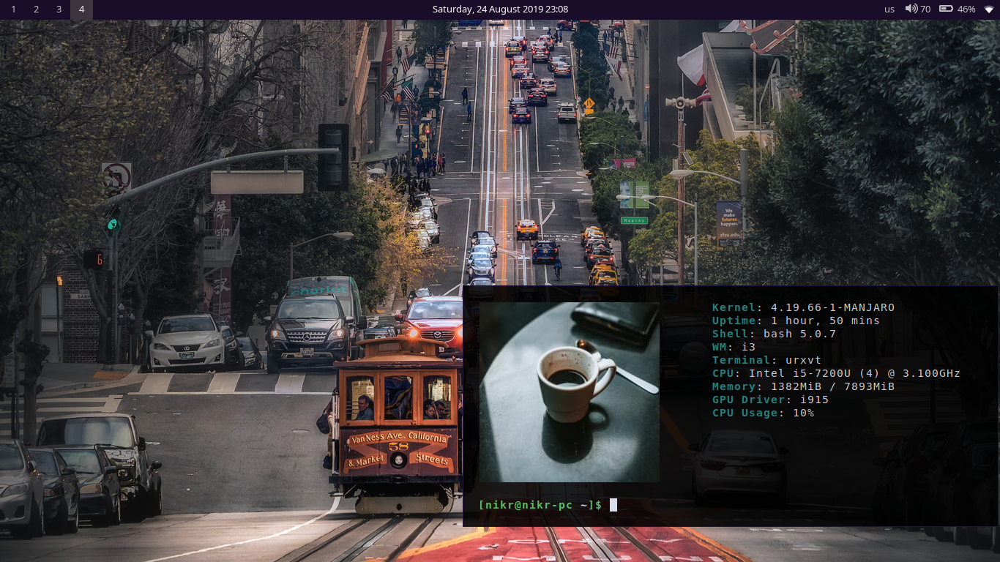

# Dotfiles Manjaro i3
> Configuration files for styling i3 environment.

#### My configuration files for i3, rofi, urxvt, polybar


## Prerequisites

* [Polybar](https://github.com/polybar/polybar)
* [PulseAudio](https://www.freedesktop.org/wiki/Software/PulseAudio/)
* [Pavucontrol](https://github.com/pulseaudio/pavucontrol)
* [Light](https://github.com/haikarainen/light)

* Optional

    - [Uxrvt](https://github.com/exg/rxvt-unicode)
    - [Thunar](https://github.com/xfce-mirror/thunar)

### You can import and install dependencies via pacman
```
pacman -S --needed - < pkglist.txt  
```


## Installation

Linux:

```
Copy the project files to your $HOME directory.
 
chmod +x ~/.config/polybar/launch.sh
 
Reboot or reload your system.
```

## Useful bindings:

```
mod+Ctrl+M Pavucontrol
mod+F2 Firefox 
mod+Shift+D Thunar
mod+Plus (+) VolumeUp
mod+Subtract (-) VolumeDown
mod+Ctrl+Plus BrightnessUp
mod+Ctrl+Subtract BrightnessDown

 
```

  


#### Whoami

Nikos Rigas – [@https://twitter.com/rignikos](https://twitter.com/rignikos) 

[https://github.com/NikosRig](https://github.com/NikosRig)


